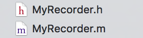
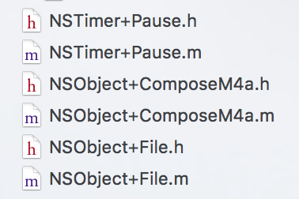

# MyRecorder

一个基于 AVAudioRecorder 实现的录音组件，支持录音、暂停、继续和试听功能。

## 用法

MyRecorder 只有一个类：



已及几个分类：



将它们添加到你的项目中即可。

## 初始化

在 ViewController 的 viewDidLoad 中，初始化一个 MyRecorder:

	_recorder= [[MyRecorder alloc]initWithDelegate:self];
	
## 实现 MyRecorderDelegate 委托协议

首先在 ViewController 中声明对该协议的实现：

	@interface ViewController ()<MyRecorderDelegate>

然后实现协议方法：

```swift
#pragma mark - MyRecorderDelegate
-(void)recorderGetPermissionFailed:(MyRecorder *)recorder{
    // 用户不同意获取麦克风
    UIAlertController *alertController = [UIAlertController alertControllerWithTitle:@"麦克风不可用" message:@"请在“设置 - 隐私 - 麦克风”中允许数字红卡访问你的麦克风" preferredStyle:UIAlertControllerStyleAlert];
    UIAlertAction *openAction = [UIAlertAction actionWithTitle:@"前往设置" style:UIAlertActionStyleDefault handler:^(UIAlertAction * _Nonnull action) {
        
        NSURL * url = [NSURL URLWithString:UIApplicationOpenSettingsURLString];
        
        if([[UIApplication sharedApplication] canOpenURL:url]) {
            
            [[UIApplication sharedApplication] openURL:url];
        }
    }];
    
    [alertController addAction:openAction];
    [self presentViewController:alertController animated:YES completion:nil];
}
-(void)recorder:(MyRecorder *)recorder stateChanged:(MyRecorderState)state{
    switch (state) {
        case MyRecorderStateIsReady:
            
            [_btnBegin setTitle:@"开始录制" forState:UIControlStateNormal];
            _lbMessage.text = @"点击开始录音，最长录制3分钟哦~";
            _btnSave.hidden =_btnRedo.hidden = _btnPreview.hidden = YES;
            break;
        case MyRecorderStatePaused:
            [_btnBegin setTitle:@"继续录制" forState:UIControlStateNormal];
            _lbMessage.text = @"";
            
            _btnSave.hidden =_btnRedo.hidden = _btnPreview.hidden = NO;
            break;
        case MyRecorderStateRecording:
            [_btnBegin setTitle:@"暂停录制" forState:UIControlStateNormal];
            _lbMessage.text = @"正在录制...";
            _btnSave.hidden =_btnRedo.hidden = _btnPreview.hidden = YES;
            
            break;
        default:
            break;
    }
}
-(void)recorder:(MyRecorder *)recorder secondChanged:(NSInteger)second{
    if(second == 0){
        _lbTime.text = @"00:00";
    }else{
        _lbTime.text = [self convertTimeToString:second];
    }
}
```
第一个方法用于获取用户授权失败时调用，因为录音需要 App 获得麦克风的访问权限。如果用户没有授权或拒绝授权，你需要在这里进行提示或者干脆终止程序。
第二个方法当录音状态发生改变，比如暂停/继续时通知你进行必要的处理，你需要在这里根据不同状态刷新 UI。
第三个方法在录音过程中计时器的时间发生改变时调用（每隔一秒调用一次），这里，你需要录音的当前时长显示给用户。

## 控制录音进程

1. 开始/继续录音

	[self.recorder beginOrResumeRecord];

2. 暂停录音

	[self.recorder pauseRecord];
	
3. 重新开始录音

	[self.recorder redoRecord];
	
## 播放录音

	[_recorder playTest];
	
需要注意，如果录音过程中使用过暂停功能，则每次暂停都会将这次录音的数据和之前的数据合并。试听时会播放从一开始到现在的完整录音。

## 属性定义

1. state 表示 MyRecorder 的当前状态，类型为 MyRecorderState 枚举;
2. maxRecordSeconds 表示录音时间上限，即最多允许你录制多少秒；


